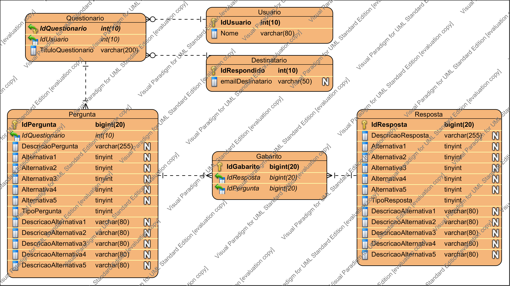

# questionário

 
&nbsp;&nbsp;&nbsp;&nbsp;&nbsp;&nbsp;&nbsp;Este sistema permite que o usuário logado possa cadastrar um questionário com N perguntas, 
as perguntas podem ser de resposta aberta ou de múltipla escolha  :-) 
&nbsp;&nbsp;&nbsp;&nbsp;&nbsp;&nbsp;&nbsp;Este questionário cadastrado pode ser enviado por email. 
&nbsp;&nbsp;&nbsp;&nbsp;&nbsp;&nbsp;&nbsp;A pessoa que receber este questionário por email somente podera responder 
 uma única vez. 

Tecnologias | Logo
:-------------: | :-------------:
Angular JS | </a>
Bootstrap | </a>
Spring Security | </a>
Spring MVC | </a>
Hibernate | </a>
Maven | </a>
SLF4J | </a>

 

___

##### Modelagem Banco
 </a>

___

 

BANCO:
O banco usado é o MYSQL.

Na pasta resource faça a configuração de conexão ao banco e os dados
referentes a conta de email utilizada para fazer o envio,
no arquivo (application.properties)

Primeiro deve ser criado um schema no banco e depois
configurados os dados nas seguintes classes.

No pacote br.com.questionario.tool, na classe HibernateDLLGenerator
configure o usuario e senha do banco de dados, Execute esta classe.

Faça um INSERT manual na tabela USUARIO , o campo (email) será o campo utilizado para login

Faça um INSERT manual na tabela AUTHORITYTYPE, o campo (authoritytype_name) sendo ROLE_ADMIN

 

EMAIL:
no pacote br.com.questionario.util  na classe (SendMailStart)
configure o seu email de remetente,preferência no que foi testado que o Gmail.

OBS::  
Ao fazer os testes é necessário desabilitar o seu antivirus, e seu firewall.
Usando AVAST é gerado um erro .

SERVIDOR :
Utilizado Tomcat 7.0.41  ele tem que ser configurado para a porta 8084

APLICAÇÃO: Para utilizar a aplicação é necessário fazer o login com usuario sendo o criado no campo (email) da tabela
usuario e a senha do campo (password)

Depois Crie um questionário com seu titulo e  suas perguntas.

Depois faça o envio do questionário que deseja para (apenas 1 email e cada vez).

Acesse o email, e responda e questionário , depois tente responder novamente.

Ends ..
